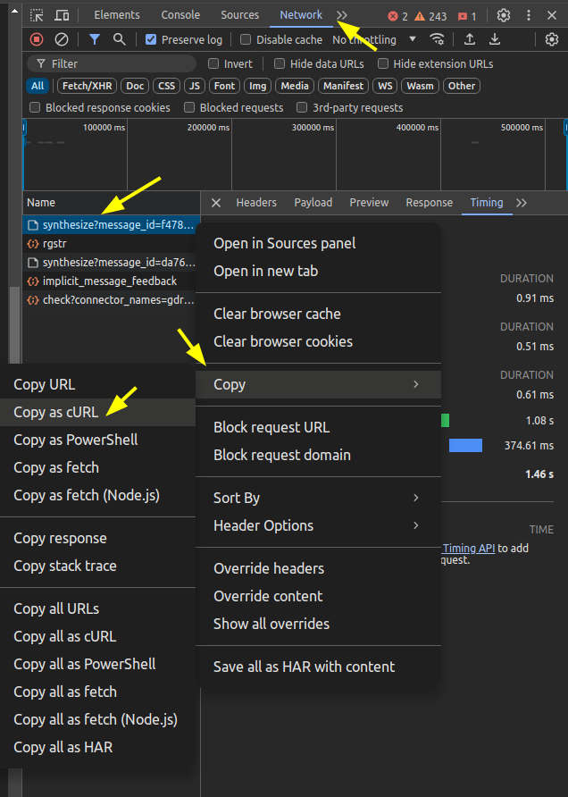

````markdown
# Curl Command Downloader

This Python script reads curl commands from files in the `curl_commands` folder, downloads the corresponding files, and saves them to the `output` folder. Once downloaded, the curl command file is moved to the `downloaded` folder. If the folders do not exist, they are created automatically.

## Description

This script can be used to download text-to-speech (TTS) audio files from chatGPT. By placing curl commands that request TTS audio files into the `curl_commands` folder, the script automates the download process and organizes the files for you.

## Requirements

- Python 3.x
- `requests` library

Install the required library using:

```sh
pip install requests
```
````

## Usage

1. **Place Curl Commands:**

   - Create a folder named `curl_commands`.
   - Place text files containing your curl commands in this folder. Each file should contain one curl command.

2. **Run the Script:**

   - Execute the script using Python:
     ```sh
     python batch_download.py
     ```

3. **Check Downloaded Files:**
   - The downloaded files will be saved in the `output` folder.
   - The original curl command files will be moved to the `downloaded` folder.

## How to Obtain Curl Commands for OpenAI TTS

To download TTS audio files from OpenAI, you need to obtain the appropriate curl commands. Here’s how you can do it using your browser's Developer Tools:

1. **Open Developer Tools:**

   - In your browser (e.g., Chrome), right-click on the page and select "Inspect" or press `Ctrl+Shift+I` (`Cmd+Option+I` on Mac) to open Developer Tools.

2. **Go to the Network Tab:**

   - In Developer Tools, navigate to the "Network" tab.

3. **Perform the Action to Trigger the Request:**

   - Click the 'Read Aloud' button under gpt's reply to generates the TTS audio.

4. **Find the Request:**

   - Look for the network request that corresponds to the TTS audio. It will typically be a `synthesize` request.

5. **Copy the Curl Command:**

   - Right-click on the request and select "Copy" -> "Copy as cURL".

   

6. **Save the Curl Command:**
   - Paste the copied curl command into a text file and save it in the `curl_commands` folder.

## Script Explanation

- **Folders:**

  - `curl_commands`: Contains the input curl command files.
  - `downloaded`: Contains the processed curl command files.
  - `output`: Contains the downloaded files.

- **Function `download_file_from_curl(curl_command, output_filename)`:**
  - Parses the URL and headers from the curl command.
  - Sends an HTTP GET request to download the file.
  - Saves the downloaded file with the given output filename.
  - Returns `True` if the download is successful, otherwise `False`.

## Notes

- Ensure your curl commands are correctly formatted and that the headers and tokens are valid.
